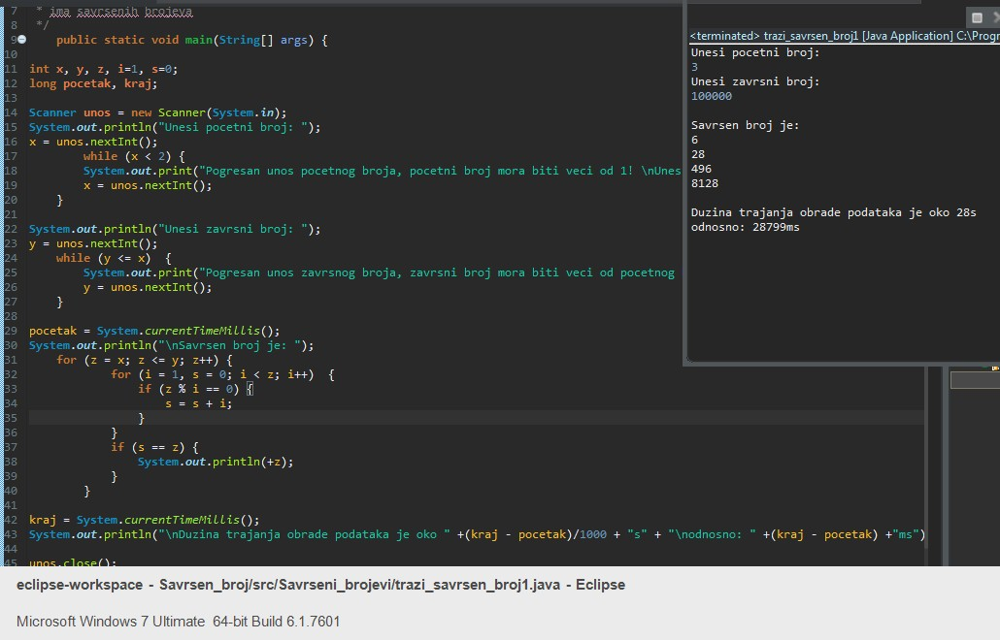
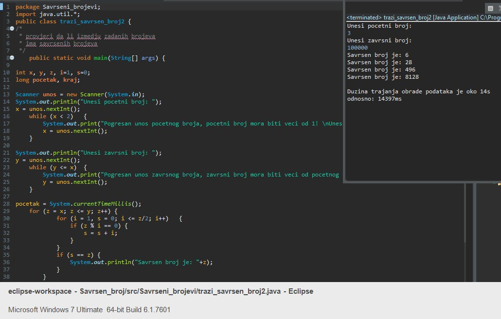
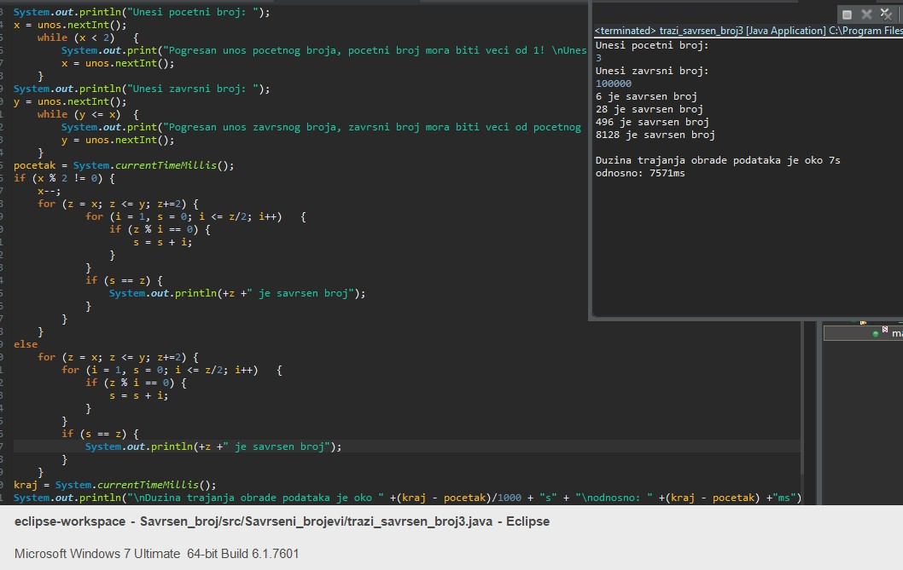

<h1 align="center" style="color:blue;">Perfect-number-JAVA</h1>

## General info
In number theory, a perfect number is a positive integer that is equal to the sum of its positive divisors, excluding the number itself.
This is a java project that calculate perfect numbers from given range of numbers. Purpose of project is learning to code.

Project consist of three version, all versions are given to calculate the same range (3 to 100.000). By modifying code time to calculate numbers
from version 1 to version 3 is speed up more than 70%.

## Demo	
#### Time to calculate 28 sec.


#### Time to calculate 14 sec.

  
#### Time to calculate 7 sec.


## Technologies
Project is created with:
* JAVA	
  
## Code
### <h4>First version code  :star:</h4>
The expected time for calculation is approximate 25 sec.
```java
pocetak = System.currentTimeMillis(); //start time
System.out.println("\nSavrsen broj je: ");
	for (z = x; z <= y; z++) { //for all int between first and end int
			for (i = 1, s = 0; i < z; i++)	{  //for all int from 1 and end int
				if (z % i == 0)	{  //check is first int the division remainder
					s = s + i;  //if yes, add i to s
				}
			}
			if (s == z)	{
				System.out.println(+z);
			}
		}
```
### <h4>Second version code  :fire:</h4>
The expected time for calculation is approximate 14 sec.
line for (i = 1, s = 0; i <= z/2; i++) check only even numbers
 ```java
  pocetak = System.currentTimeMillis();
	for (z = x; z <= y; z++) {
			for (i = 1, s = 0; i <= z/2; i++)	{  // i <= z/2 speed up code for 50%, that means only even numbers will bee calculated
				if (z % i == 0)	{
					s = s + i;
				}
			}
			if (s == z)	{
				System.out.println("Savrsen broj je: "+z);
			}
		}
  ```
  ### <h4>Third version code :collision:</h4> 
  The expected time for calculation is approximate 7 sec.
  ```java
pocetak = System.currentTimeMillis();
if (x % 2 != 0) {
	x--;
	for (z = x; z <= y; z+=2) {
			for (i = 1, s = 0; i <= z/2; i++)	{
				if (z % i == 0)	{
					s = s + i;
				}
			}
			if (s == z)	{
				System.out.println(+z +" je savrsen broj");
			}
		}
	}
else
	for (z = x; z <= y; z+=2) {
		for (i = 1, s = 0; i <= z/2; i++)	{
			if (z % i == 0)	{
				s = s + i;
			}
		}
		if (s == z)	{
			System.out.println(+z +" je savrsen broj");
		}
	}
kraj = System.currentTimeMillis();
```

## Status
Project is: _in progress_

## Inspiration
Euclid, the great Greek mathematician... :100:

## Support
Any recommendations or suggestion are welcome...
